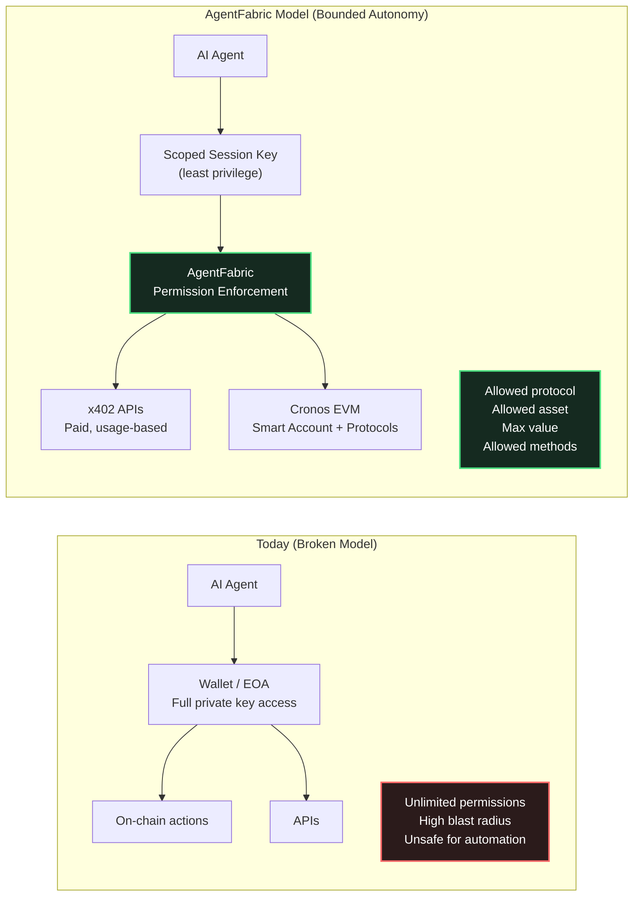
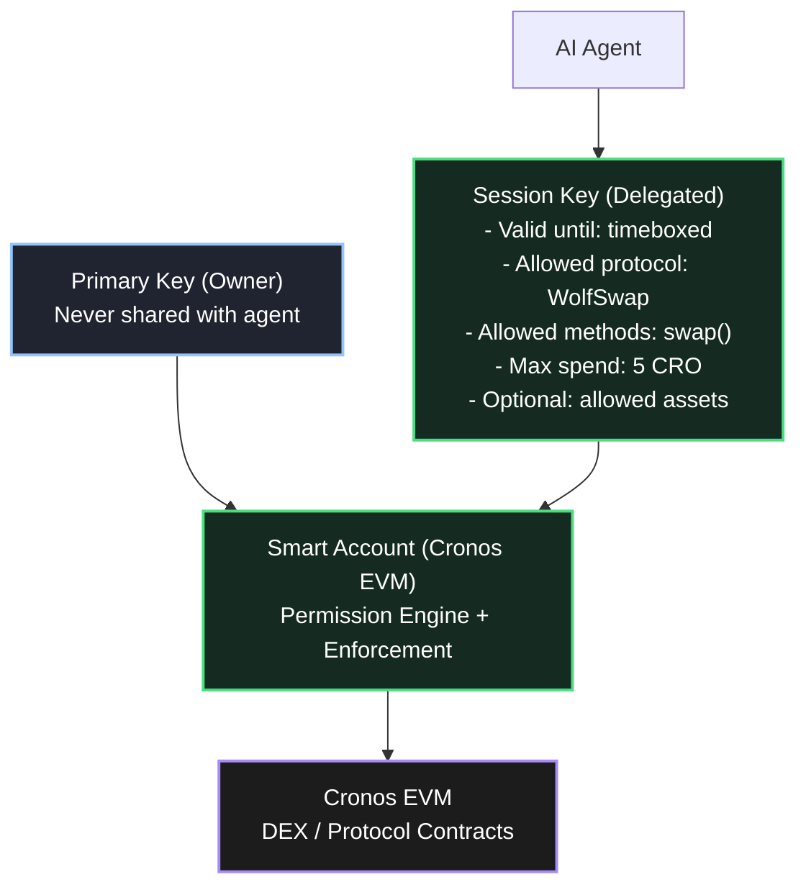
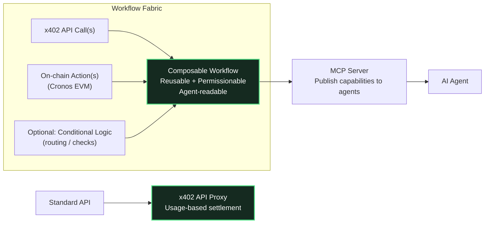
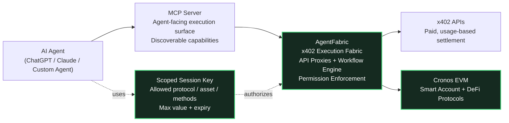

# AgentFabric

**Agents with limits.**

AgentFabric is an agent-native x402 execution fabric that enables AI agents to safely interact with paid APIs and on-chain workflows on Cronos EVM, using scoped, programmable permissions.

Agents never access a user's primary private key.
Instead, they operate via session keys with explicit, enforceable limits — such as which protocol, which asset, and how much value they are allowed to use.

---

## What AgentFabric Enables

- AI agents that can execute on-chain actions safely
- x402-native APIs with usage-based settlement
- Composable workflows combining APIs + smart contracts
- MCP servers for agent discovery and interaction
- Bounded autonomy via scoped session permissions

AgentFabric turns APIs and workflows into agent-readable economic primitives, without sacrificing custody or control.

---

## Why AgentFabric Exists

AI agents are becoming capable of real financial decision-making — but today's execution models are broken:

- Agents either cannot act at all, or
- They require full access to private keys, creating unacceptable risk

This tradeoff blocks adoption of agentic finance.

AgentFabric solves this by introducing a permissioned execution layer:

- autonomy without custody
- composability without danger
- automation without hot wallets

---

## Core Architecture

AgentFabric is built around five core primitives:

### 1. Smart Account Upgrade

A standard EOA is upgraded into a smart account capable of enforcing:

- session keys
- scoped permissions
- bounded execution

The primary key is never shared.

---

### 2. Scoped Session Keys

Session keys define exactly what an agent can do, including:

- allowed contracts / protocols
- permitted assets
- maximum value
- specific methods (e.g. swap only)

This follows the principle of least privilege.

---

### 3. x402 API Proxies

Any API can be wrapped as an x402-compatible, usage-based endpoint, allowing:

- programmatic payment
- agent-native consumption
- composable economic primitives

---

### 4. Workflow Fabric

Multi-step workflows combine:

- x402 API calls
- on-chain actions
- conditional logic

Workflows are reusable, permissionable, and agent-readable.

---

### 5. MCP Servers

Selected APIs and workflows are exposed as MCP servers, enabling:

- agent discovery
- standardized invocation
- safe execution surfaces for AI systems like ChatGPT and Claude

---

## End-to-End Flow (High Level)

1. A developer or user defines APIs and workflows
2. A smart account is deployed or upgraded
3. A scoped session key is generated for an agent
4. APIs and workflows are exposed via an MCP server
5. The agent discovers, reasons, and executes within strict boundaries
6. Transactions settle on Cronos using x402-compatible flows

**Result:** autonomous execution without autonomous risk.

---

## Demo Scenario (Hackathon Highlight)

In the demo, AgentFabric shows an AI agent performing the following task:

> "Find the top trending token on Cronos today and buy 5 CRO worth of it."

Using AgentFabric, the agent:

1. Queries a paid x402 API for trending tokens
2. Selects the top result
3. Executes a swap via a prebuilt WolfSwap DEX aggregation workflow
4. Settles the transaction on Cronos EVM

At no point does the agent access the user's private key.
All actions are executed within scoped permissions.

---

## Built for Cronos & x402

AgentFabric is:

- deployed on Cronos EVM
- designed for x402-style programmatic payments
- compatible with Crypto.com ecosystem tooling
- aligned with agentic finance and AI-native infrastructure

This makes Cronos a safe, first-class execution environment for AI agents.

---

## Use Cases

- Agent-triggered DeFi actions
- Automated portfolio management
- Risk-bounded trading bots
- Paid API access for AI agents
- Agent-readable developer tooling
- Institutional-grade agent workflows

---

## Hackathon Tracks

AgentFabric qualifies for:

- Main Track — x402 Applications
- x402 Agentic Finance / Payment Track
- Crypto.com x Cronos Ecosystem Integration
- Dev Tooling & Data Virtualization Track

---

## License

MIT

---

## Links

- Website: https://agentfabric.tools
- Demo: https://www.youtube.com/watch?v=xfvH6TqvJd8
- Hackathon Submission: https://dorahacks.io/buidl/38376

### Source Code

- [Smart Account & Session Keys](https://github.com/nschwermann/agent_fabric/tree/main/hardhat) — ERC-7702 delegation contracts with scoped permissions
- [x402 Proxies & Workflows](https://github.com/nschwermann/agent_fabric/tree/main/apps/web) — Next.js app for API proxies, workflows, and marketplace
- [MCP Server](https://github.com/nschwermann/agent_fabric/tree/main/apps/mcp-server) — Express server exposing tools and workflows via MCP protocol
